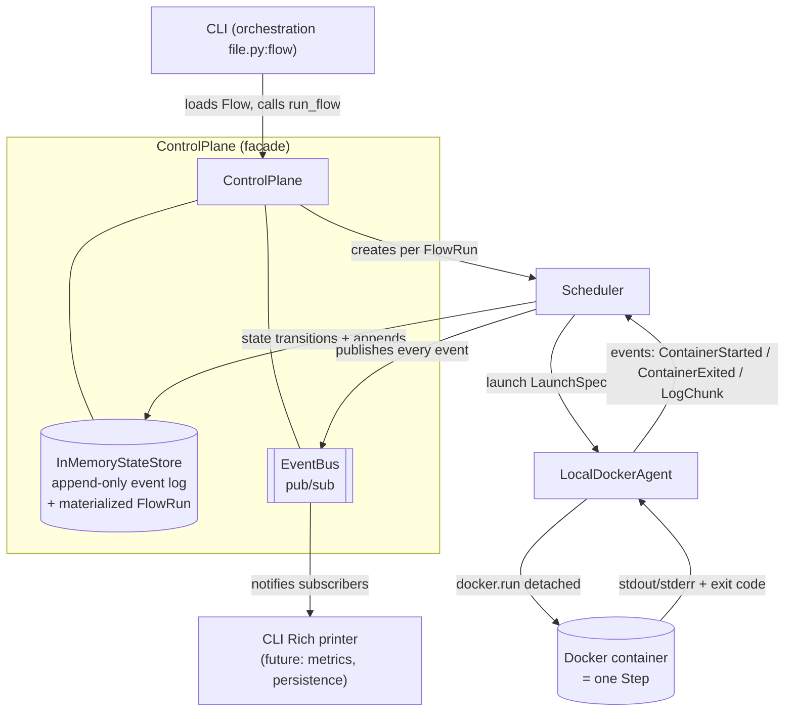
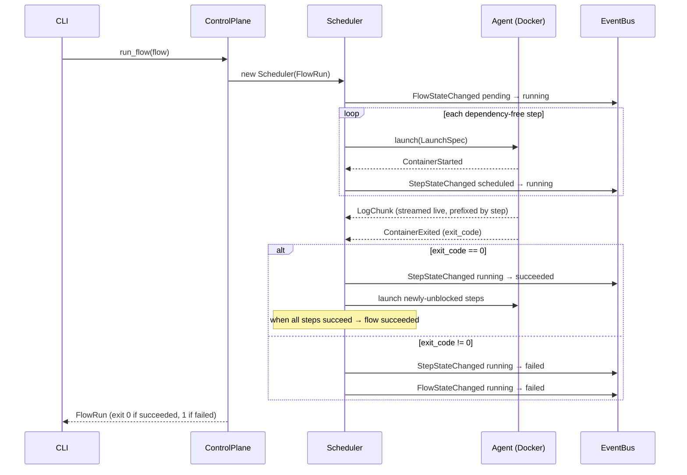
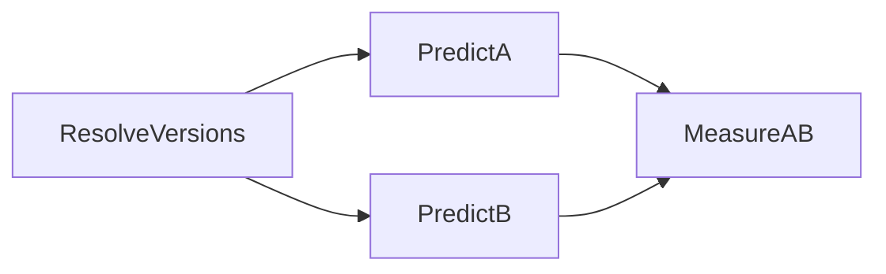

# ml-orchestration

A small, dependency-light **container DAG orchestrator** plus an example **MLOps
pipeline** that runs on it. You declare a flow as a set of `Step`s (each a Docker
image + command) wired by dependencies; the orchestrator walks the DAG, launches
each step as a container, streams its logs, and advances state from events until
the flow succeeds or a step fails.

The repository has two layers:

- **`src/orchestration/`** — the generic engine: a CLI, a control plane, a
  per-flow scheduler, and a Docker agent. It knows nothing about ML.
- **`src/pipeline/`** — the example workload: a drug-review sentiment pipeline
  (data prep → train → robustness, plus post-deployment drift monitoring, flow
  versioning, offline A/B, and closed-loop adaptation). See
  [src/pipeline/README.md](src/pipeline/README.md) for its deep dive, and
  [deploy/README.md](deploy/README.md) for the decoupled (MLflow + MinIO) stack.

---

## Architecture

The static component structure. The `ControlPlane` owns a state store, an event
bus, and an agent; each `run_flow` spins up a `Scheduler` that drives one
`FlowRun` by launching containers through the agent and reacting to events.



- **`Flow` / `Step` / `Resources`** ([types.py](src/orchestration/types.py)) — the
  user-facing declarative API. `Flow.topological_order()` is Kahn's algorithm and
  rejects cycles.
- **`ControlPlane`** ([control_plane.py](src/orchestration/control_plane.py)) — wires
  the store, bus, and agent, and runs a flow end-to-end.
- **`Scheduler`** ([scheduler.py](src/orchestration/scheduler.py)) — one per
  `FlowRun`; launches every step whose deps have all `succeeded`, then advances
  state as container events arrive.
- **`LocalDockerAgent`** ([agent.py](src/orchestration/agent.py)) — runs each step
  as a detached Docker container and pumps logs + exit status back as events.
- **`InMemoryStateStore`** ([state.py](src/orchestration/state.py)) — append-only
  event log with a materialized `FlowRun` view (event-sourced).
- **`EventBus`** ([bus.py](src/orchestration/bus.py)) — fan-out so the CLI (and
  future subscribers) can observe everything one execution does.

## Flow (runtime execution)

How a single flow run progresses over time. The scheduler launches all
dependency-free steps, then each container exit either unlocks downstream steps
(exit 0) or fails the whole flow (non-zero).



---

## Installation (from scratch)

**Prerequisites**

- Python **3.10+**
- **Docker** (running) — steps execute as containers
- `git`

**1. Clone and create a virtual environment**

```bash
git clone https://github.com/wassilysavin/ml-orchestration.git
cd ml-orchestration

python3 -m venv .venv
source .venv/bin/activate          # Windows: .venv\Scripts\activate
python -m pip install --upgrade pip
```

**2. Install the orchestrator (editable)**

```bash
pip install -e .                   # installs the `orchestration` CLI + core deps
orchestration --help               # verify it's on PATH
```

This pulls only the engine's runtime deps (`docker`, `typer`, `rich`). The ML
pipeline's heavier deps live in its Docker images, not your venv.

**3. Build the example pipeline's images (one-time)**

```bash
cd src/pipeline
docker build -f Dockerfile.data  -t mlops-data:latest  .
docker build -f Dockerfile.train -t mlops-train:latest .
cd ../..
```

**4. (Optional) install the pipeline locally to run/develop it without containers**

```bash
cd src/pipeline
pip install -r requirements.txt -r requirements-train.txt
python -m pytest -q                # run the test suite
cd ../..
```

---

## Usage (terminal)

### Run a flow through the orchestrator

The CLI loads a `Flow` object from `path/to/file.py:flow_variable` (or
`package.module:flow_variable`) and runs it. Exit code is **0** if the flow
succeeds, **1** if any step fails. Container logs stream live, prefixed by step.

```bash
# the end-to-end MLOps pipeline: DataPrep → Train → Robustness
orchestration examples/mlops_pipeline.py:flow

# suppress the event stream (only the final exit code matters)
orchestration examples/mlops_pipeline.py:flow --quiet
```

The post-deployment flows ([examples/post_deployment_flows.py](examples/post_deployment_flows.py))
are each a separate DAG you select by variable name:

```bash
orchestration examples/post_deployment_flows.py:monitoring_flow          # MeasureDrift → EvaluateDrift (gates on significant drift)
orchestration examples/post_deployment_flows.py:versioned_training_flow  # DataPrep → TrainVersioned → RobustnessVersioned
orchestration examples/post_deployment_flows.py:ab_flow                  # ResolveVersions → (PredictA ∥ PredictB) → MeasureAB
```

The A/B DAG is the fan-out/fan-in case — `PredictA` and `PredictB` run
concurrently after `ResolveVersions`, and `MeasureAB` waits on both:



### Write your own flow

```python
from orchestration import Flow, Step, Resources

class Ingest(Step):
    """Pull raw input into the shared data volume."""
    image = "alpine:3.19"
    command = ["sh", "-c", "echo ingesting"]
    volumes = {"/abs/host/path": "/app/data"}   # bind-mount, rw
    resources = Resources(cpu=0.5, memory_gb=0.25)

class Train(Step):
    """Train on the ingested data."""
    image = "alpine:3.19"
    command = ["sh", "-c", "echo training"]

flow = Flow("hello")
ingest = flow.add(Ingest())
flow.add(Train(), after=ingest)     # `after` accepts one step or a list
```

Save as `my_flow.py`, then:

```bash
orchestration my_flow.py:flow
```

### Run the example pipeline directly (no orchestrator)

Each pipeline flow is also a standalone script — useful for development. From
`src/pipeline/` (with the local install from step 4 above):

```bash
python flow.py                                   # the sequential training pipeline
python monitoring_flow.py evaluate --gate        # drift check; non-zero exit on significant drift
python training_flow.py --variant challenger     # a specific versioned training config
python adaptation_flow.py                         # closed-loop: measure → decide → retrain/A-B/promote
```

For the decoupled multi-container stack (MLflow server + Postgres + MinIO), see
[deploy/README.md](deploy/README.md).
