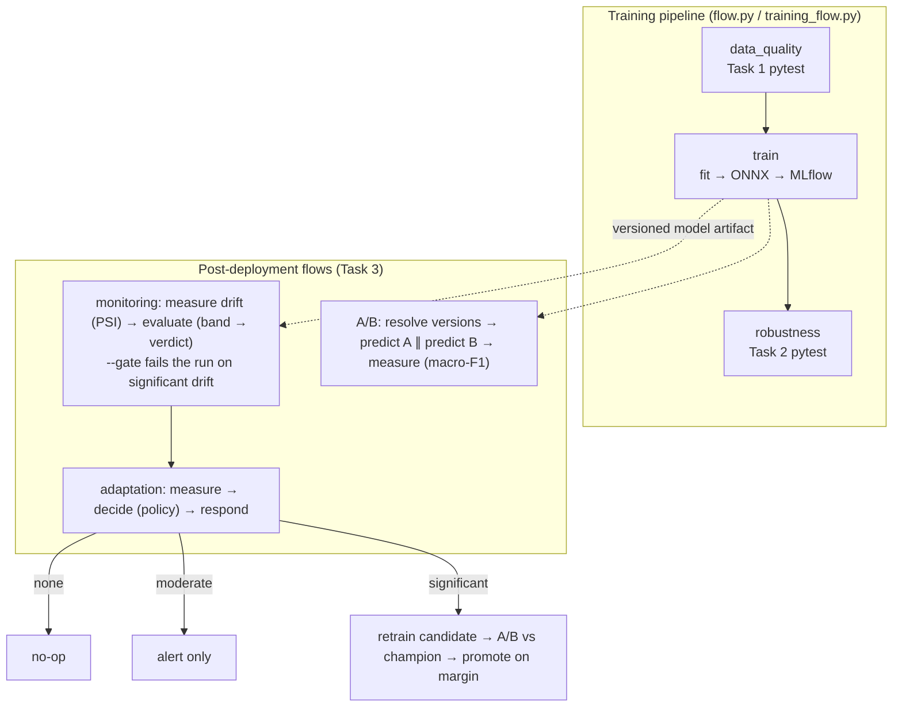

# Drug-review sentiment pipeline

The example MLOps workload that runs on the orchestrator (see the
[root README](../../README.md) for the engine and its diagrams). It trains a
binary sentiment classifier on UCI drug reviews and layers post-deployment
concerns on top: drift monitoring, flow versioning, offline A/B, and a
closed-loop adaptation step. Each flow below is both a standalone script (`python
<flow>.py`) and an orchestrator DAG (`examples/post_deployment_flows.py`).

## Pipeline flow



The bands, thresholds, promotion margin, and `flow_run_id` correlation are
detailed in the Task 3 sections below.

---

#### Missingness Expectation

Test file: tests/test_missingness.py
Column checked: "condition"
Expectation: the missing value rate for "condition" in the current split must be less than or equal to 1%.

#### Where this expectation comes from

The expectation is derived from the observed missingness in the original dataset from Kaggle.

#### Why this expectation was chosen

"condition" is the only field with meaningful natural missingness in this dataset. Because the baseline is already around 0.56%, setting the threshold to 1% gives a small safety margin for minor noise while still being strict enough to catch real regressions.

#### Numeric Distribution Expectation

Test file: tests/test_numeric_distribution.py
Column checked: "rating"
Expectation: the Kolmogorov-Smirnov (KS) statistic between the reference split and current split must be less than or equal to 0.02.

#### Where this expectation comes from

The expectation is derived from the fact that both splits come from the same published UCI dataset source and should therefore have very similar numeric behavior. 

#### Why this expectation was chosen

The "rating" column is a core numeric feature, so a large shift in its distribution would indicate that the current data no longer resembles the reference data used for training assumptions.

The threshold 0.02 was chosen because:

it is comfortably above the observed baseline (0.003389)
it still remains strict enough to detect a meaningful shift
it allows normal sampling variation between train and test splits from the same source

#### Categorical Distribution Expectation

Test file: tests/test_categorical_distribution.py
Column checked: "condition"
Expectation: the total variation distance (TVD) between the reference split and current split must be less than or equal to 0.05.

#### Where this expectation comes from

The expectation is derived from the observed category mix in the same published dataset source.

#### Why this expectation was chosen

"condition" is a categorical feature with many labels. Because of that, small differences in category frequencies are expected even when both splits come from the same source. A threshold of 0.05 was chosen because:

it is above the observed baseline (0.030598)
it tolerates moderate sampling noise across many categories
it still flags a substantial change in the case mix of medical conditions

#### General

Pre-training data-quality tests for the UCI Drug Review dataset, sourced from the Kaggle mirror jessicali9530/kuc-hackathon-winter-2018. The pipeline downloads the raw train and test CSVs into data/raw/, also writes the test split as a columnar Parquet copy for later use, builds processed per-split Parquet artifacts under data/processed/, and runs three pytest checks: a Pandera missingness check on the condition column (<= 1%), a KS drift check on rating between the train and test splits (<= 0.02), and a total-variation-distance check on the condition distribution between the two splits (<= 0.05). Thresholds are derived from the observed baselines in the published files and are documented alongside the tests.

---

### Task 2 - Pre-deployment Tests

#### Sentiment Modeling Target

Task 2 trains a binary sentiment classifier on `review_text`. Labels are derived from `rating`: `rating >= 7` is positive, `rating <= 4` is negative, ratings 5 and 6 are dropped as ambiguous (~15% of rows). The reference split (Kaggle train) is used for fitting and the current split (Kaggle test) for evaluation, mirroring how Task 1 already uses the two splits.

The model is a `TfidfVectorizer` (word 1-2 grams, `min_df=5`, `max_features=100_000`, sublinear TF) feeding a balanced `LogisticRegression`. The fitted pipeline is converted to ONNX (via `skl2onnx`) and persisted as a `model.onnx` file. ONNX is a genuinely format-distinct serialization from pickle: a documented binary spec, language-agnostic, and broadly tooled. Artifacts are versioned via MLflow with a local file backend under `mlruns/` (using the `mlflow.onnx` flavor so the registered model matches the on-disk format). A `metadata.json` is written next to each model under `models/<run_id>/` recording the input schema, output schema, label mapping, training and evaluation row counts, metrics, the serialization format, and the dependencies file. Inference goes through `src.registry.OnnxSentimentModel`, a thin adapter exposing sklearn-style `predict` / `predict_proba` over an `onnxruntime.InferenceSession`.

The flow is orchestrated by a small self-written sequential runner (`flow.py`, the assignment explicitly permits this). Three steps run in order; any failure aborts the pipeline:
1. `data_quality` runs the Task 1 pytest suite (`pytest -m data_quality`).
2. `train` fits the pipeline and versions the artifact.
3. `robustness` runs the Task 2 pytest suite (`pytest -m robustness`).

Each step has a separate Dockerfile (`Dockerfile.data`, `Dockerfile.train`) so dependencies are step-distinct: `requirements.txt` for data quality, `requirements-train.txt` (sklearn + skl2onnx + onnx + onnxruntime + mlflow) for training and robustness.

#### Macro-F1 Baseline Margin Expectation

Test file: tests/test_baseline_margin.py
Threshold: model macro-F1 on the current split must exceed the majority-class macro-F1 by at least 0.20.

##### Where this expectation comes from

The expectation is derived from the typical performance of TF-IDF + Logistic Regression on review-style English in this dataset's size range, where macro-F1 against the majority-class baseline (around 0.40 given the positive-skewed label distribution) is reproducibly in the 0.80-0.90 range.

##### Why this expectation was chosen

A 0.20 margin is comfortably reachable for a healthy model and tight enough to fail when the model collapses to a single class or when the training data is degraded. It catches the most basic failure mode (the model not learning at all) without being so loose that any non-trivial fit passes.

#### Invariance Expectation

Test file: tests/test_invariance.py
Threshold: average prediction agreement >= 0.95 across four benign transforms (whitespace collapse, trailing-period addition, lowercasing, 1% character swap) on a 500-review sample.

##### Where this expectation comes from

The four transforms preserve the meaning of the review at the surface level. A robust text classifier should not depend on whitespace, casing, or single-character noise, so the no-op expectation is "predictions stay the same."

##### Why this expectation was chosen

Five percent disagreement is a tight budget for surface noise alone. A larger drop indicates the model has overfit to surface tokens (capitalization, exact whitespace, individual character sequences) and is fragile to the kind of input variation that occurs naturally in production reviews.

#### Negation Expectation

Test file: tests/test_negation.py
Threshold: mean drop in original-class probability >= 0.15 after prepending one of three negation phrases (rotated). Computed on 200 reviews where the model is highly confident (max probability > 0.9) in the original prediction.

##### Where this expectation comes from

This is a directional CheckList-style behavioral test (Ribeiro et al., 2020). Inserting an explicit negation phrase should pull the prediction toward the opposite class. Models that learn vocabulary-only sentiment without engaging with negation fail this kind of check.

##### Why this expectation was chosen

A 0.15 threshold is well below a full flip but well above zero, so it is reachable without expecting the model to perfectly negate every sentence, while still failing the "keyword-driven and indifferent to negation" failure mode that bag-of-n-grams models are known for. Using only highly-confident original predictions removes noise from already-uncertain examples and concentrates the test on cases where negation should matter.

#### Training Error Handling

Test file: tests/test_min_training_rows.py
Configuration: `MIN_TRAINING_ROWS = 1000` in src/config.py.

The training step refuses to fit when the post-filter training set has fewer than 1000 rows, raising `InsufficientTrainingDataError`. Below 1000 rows a TF-IDF + Logistic Regression model on English reviews tends to overfit single-document features and produces a model that can still pass naive accuracy checks on a similarly small evaluation set, hiding a degenerate artifact behind plausible-looking metrics. Failing the flow with a clear message that surfaces the actual row count is preferable to versioning an artifact that downstream consumers might trust. The test exercises the guard by monkeypatching the data loaders to return a 50-row sample and asserting that `train()` raises.

---

### Task 3 - Post-deployment Tests

Task 3 adds three independent flows on top of the training flow: a drift-monitoring flow, a versioned re-run of the training flow, and an offline A/B flow. They run locally against the `.venv` interpreter:

```
.venv/bin/python training_flow.py --variant baseline      # flow version dfda8c64c3e3
.venv/bin/python training_flow.py --variant challenger    # flow version e39940d83d56
.venv/bin/python monitoring_flow.py                       # drift test on the unseen segment
.venv/bin/python ab_flow.py                               # A/B: baseline vs challenger
```

All runs are tracked in MLflow under three experiments: `drug-review-sentiment` (versioned training runs), `drug-review-monitoring` (drift checks), and `drug-review-abtest` (A/B runs). New pytest markers `monitoring`, `flow_versioning`, and `abtest` cover the pure logic.

> Note on MLflow store: the Task-2 `mlruns/` was created inside Docker with artifact paths under `/app`, which a local interpreter cannot write to. It was archived to `mlruns_docker_legacy/` (not deleted) so MLflow could recreate the store with local paths. The on-disk model store under `models/` was untouched.

#### Multiple simultaneous experiments

Modules: `src/experiment.py` (one experiment) + `run_experiments.py` (concurrent batch). Namespacing: `src/mlflow_setup.py`.

An *experiment* is the unit you run many of at once — each is a full pipeline (versioned training of N configs → monitoring → A/B over the pairs), carrying an `experiment_id`. That id (env `EXPERIMENT_ID`) does two things so any number of experiments can run together without colliding:

- **Namespacing** — every MLflow experiment name is prefixed (`<id>:drug-review-sentiment`, `…-monitoring`, `…-abtest`) and every run is tagged `experiment_id`, so results stay isolated yet individually queryable. `flow_registry` resolves `flow_version_id → run_id` *within* the experiment's namespaced training experiment, so two experiments that happen to train the same config resolve to their own models.
- **Concurrency-safe isolation** — the MLflow file backend is not safe for concurrent writers, so in local mode each experiment gets its own tracking store (`mlruns_experiments/<id>`). In remote mode the shared MLflow server (Postgres) serializes writes, so only the namespacing applies. Set `MLFLOW_TRACKING_URI` to run the batch against the `deploy/` stack instead.

```
python run_experiments.py                      # built-in demo: 3 experiments at once
python run_experiments.py --specs-file b.json  # your own batch (list of specs)
python run_experiments.py --max-concurrency 4
```

The launcher runs each experiment as an isolated subprocess (`EXPERIMENT_ID` set per child), caps concurrency, and aggregates a per-experiment summary. Verified end-to-end: three experiments ran simultaneously (≈3× speedup, no collisions); the *same* config trained in two different experiments produced two distinct models, each resolved correctly within its own namespace, and each experiment's tracking store contained only its own runs. Unset `EXPERIMENT_ID` and behavior is identical to the original single-experiment flows (markers `experiments` cover the namespacing).

**Runtime — subprocess or container.** `--runtime` selects how each experiment is launched. `subprocess` (default) runs one process per experiment on the host. `docker` runs each experiment as its **own container** against the remote MLflow server, isolated by `EXPERIMENT_ID` on the shared Postgres/MinIO store:

```
# build the flow image once
docker build -f Dockerfile.flow -t mlops-flow:latest .

# bring up the deploy/ stack, then launch each experiment as a container
python run_experiments.py --runtime docker \
       --mlflow-uri http://mlflow:5000 \
       --network mlops-decoupled_default
# add --dry-run to print the exact `docker run` per experiment without executing
```

Each container binds only the dataset (read-only) and `experiments_out/` (so result JSON returns to the host); models and runs flow through the MLflow server, so containers share nothing locally. The same `EXPERIMENT_ID` namespacing keeps them apart — processes today, containers tomorrow, identical collision guarantees. (One container *per experiment*; for one container *per step* per experiment, express each experiment as an orchestration `Flow` and run it through `src/orchestration/` — see `examples/post_deployment_flows.py`.)

##### Decoupled variant (each component on its own node)

The same flows run in a network-services topology — MLflow tracking server + MinIO (S3) artifact store + Postgres — instead of shared local directories. This is driven by one env var: when `MLFLOW_TRACKING_URI` is set (`src/mlflow_setup.py`), tracking goes over HTTP and `registry.load_model` pulls the model from the MLflow artifact store when it is not on local disk — so the A/B node can use a model a training node produced without any shared `models/`/`mlruns/` directory. Unset, behavior is identical to the local runs. See `deploy/docker-compose.yml` and `deploy/README.md`. The path was verified end-to-end against a live MLflow server (training logged models to the artifact store; with local `models/` removed, the A/B flow pulled both ONNX models back over HTTP).

#### The unseen data segment (used by both the drift and A/B flows)

Selector: `src/unseen_segment.py`. The segment is the **current split** (Kaggle `drugsComTest`).

##### Where this segment comes from and why it was chosen

The model is trained **exclusively on the reference split** (`train.train` fits on `load_processed_reference` only). The current split is therefore never shown to the model during fitting, which is exactly what post-deployment tests need:

- For drift monitoring, any measured shift reflects the real gap between what the model learned and what it is asked to score, not memorised training rows.
- For the A/B test, the per-variant macro-F1 is an honest generalisation estimate because neither variant trained on this data.

Both splits come from the same published source, so under the null hypothesis ("no drift / normal generalisation") the current split should look distributionally like the reference split — which is the expectation the drift threshold encodes. The whole split is used (not a sub-sample) so the segment is fixed and reproducible across every run.

#### Drift test (monitoring flow)

Flow: `monitoring_flow.py` (two steps: `measure` → `evaluate`). It is independent of the training flow — separate MLflow experiment, no shared training code, schedulable on its own cadence. Drift primitive: `src/drift_checks.py`.

##### What the test exactly measures

Chosen drift: **covariate (input-feature) drift on `review_length`**, measured with the **Population Stability Index (PSI)**. Both distributions are binned on the reference quantile edges, and `PSI = Σ (a − e)·ln(a/e)` over bins (reference share `e`, current share `a`). PSI is the symmetric sum of two KL-divergence terms, so it is 0 when the distributions are identical and grows as probability mass moves between bins. This is *covariate* drift (a change in the inputs), not label or concept drift, which would require serving-time ground truth we do not have. `review_length` is a cheap, always-available proxy for "what kind of text is arriving."

##### Expected behavior and where it is sourced

The "expected" distribution is the **training/reference split** — the data the deployed model actually learned from. That is the correct source because drift only matters relative to what the model was fit on: production inputs that match the training distribution are, by construction, the regime where the model's measured performance holds. The numeric expectation is "PSI ≈ 0, and below the 0.25 significant-drift band." The 0.10/0.25 bands are the industry-standard PSI rule of thumb (no / moderate / significant shift).

##### Result of the run

`PSI(review_length) = 0.000173`, band `none` → **PASS**. As expected: the unseen segment shares the reference's published source, so the inputs the model sees post-deployment match its training distribution. The same flow run against genuinely shifted production data would cross 0.25 and fail.

#### Adaptation (responding to drift)

The monitoring flow only *detects* drift; responding to it is a separate, opt-in layer so the two concerns stay decoupled. Two responses are provided, at two levels:

**1. DAG-level gate (cheap).** `monitoring_flow.py evaluate --gate` exits non-zero when the verdict is `significant`, so the orchestrated monitoring DAG (`EvaluateDrift` in `examples/post_deployment_flows.py`) is marked *failed* instead of silently succeeding — a failed run a human or cron picks up. Without `--gate` the verdict is still recorded but never fails the flow (the default, preserving the original behavior).

**2. Closed loop (full adaptation).** `adaptation_flow.py` — `measure → decide → respond`:

| Drift band | Policy action | What happens |
|---|---|---|
| `none` (PSI ≤ 0.10) | NONE | no-op |
| `moderate` (0.10–0.25) | ALERT | record + notify, no model change |
| `significant` (> 0.25) | RETRAIN | retrain a candidate → A/B vs the live **champion** on the unseen segment → **promote only if it wins by a margin**, else keep the champion |

The decision is a pure function (`src/adaptation_policy.py`); the live-model pointer is `src/promotion.py` (a `models/champion.json` record that retains the previous champion as a rollback target). Guardrails: a **promotion margin** (`PROMOTION_MIN_MACRO_F1_MARGIN`) so noise/ties never flip the live model, and a **retrain cooldown** (`RETRAIN_COOLDOWN_SECONDS`) so repeated checks can't spawn a retrain storm. Adaptation decisions are tracked in their own MLflow experiment (`drug-review-adaptation`). New pytest marker `adaptation` covers the policy and promotion logic.

```
python adaptation_flow.py                       # retrain candidate = champion's own config
python adaptation_flow.py --variant challenger  # retrain a specific candidate config
python monitoring_flow.py evaluate --gate       # DAG-level: fail on significant drift
```

**Two honest limitations.** (1) *Retraining needs labels, but covariate drift is label-free* — in a real deployment `significant` would more honestly map to ALERT until fresh labels arrive; this loop works end-to-end only because the unseen segment is the labeled Kaggle test split (the candidate config is therefore a parameter — with the dataset static, refitting the *same* config reproduces the champion and ties, so pass a different `--variant`/`--C` to see a promotion). (2) *The closed loop is an in-process driver, not a DAG* — the orchestrator has no conditional edges to branch "retrain only if drift," so only the cheap gate is expressed as DAG topology; the champion pointer also needs the MLflow registered-model-alias path (not the JSON file) in the decoupled/remote deployment.

#### Flow run id (run correlation)

Every flow execution carries a single `flow_run_id`, tagged on **all** the MLflow runs it produces, so you can query everything one execution did with `tags.flow_run_id = '<id>'` (alongside the existing `flow_name` and `experiment_id` tags). It is *reuse-or-mint* (`src/mlflow_setup.py`): the orchestrator injects its `FlowRun.id` into every step container via the `FLOW_RUN_ID` env var (`src/orchestration/agent.py`), nested in-process sub-flows inherit their caller's id, and a standalone flow with nothing in the environment mints its own 12-char id. So the id is consistent across both the orchestrated and local paths, and an adaptation run's measure/retrain/A/B sub-runs all share its id. (`flow_run_id` = one execution; `flow_version_id` = one training config; `flow_name` = which flow — three distinct identifiers.)

#### Flow versioning

Config: `src/flow_config.py` (`TrainingFlowConfig`). Driver: `training_flow.py`.

Every performance-affecting choice is lifted out of the training code and into `TrainingFlowConfig` — both *model parameters* (`C`) and *data/feature transforms* (`ngram_max`, `min_df`, the positive/negative rating boundaries). The training flow logs this whole object to MLflow plus a `flow_version_id` tag, so the *flow* is versioned, not just the resulting model. `flow_version_id` is a deterministic 12-char hash of the configuration: identical configs collapse to the same id (reproducible), and any change yields a new id.

Two named versions were executed:

| Version | flow_version_id | C | ngram_max | min_df | eval macro-F1 |
|---|---|---|---|---|---|
| baseline | `dfda8c64c3e3` | 1.0 | 2 | 5 | ~0.88 |
| challenger | `e39940d83d56` | 0.05 | 1 | 50 | ~0.80 |

The challenger deliberately changes both a model parameter (much stronger regularisation) and feature transforms (unigram-only, aggressive vocabulary pruning) so its performance is measurably different in the A/B test. The robustness step is pinned to the model the flow just trained (via `PIPELINE_MODEL_RUN_ID`) and is reported but non-fatal: `train()` persists the artifact before robustness runs, and a deliberately weaker challenger must still be produced so the A/B flow can compare it.

#### A/B test (offline)

Flow: `ab_flow.py` (three steps: `resolve` → `fork-and-predict` → `measure`). Bucketing: `src/ab_split.py`. Version→model resolution: `src/flow_registry.py`.

The flow is configured only with two `flow_version_id` values and an `ab_test_id`; step 1 resolves each version to its concrete model id by querying MLflow for the run carrying that version tag (models are stored under `models/<mlflow_run_id>/`, so the resolved run id *is* the model id). That indirection is the payoff of flow versioning — the A/B config references reproducible flow versions and the model ids are looked up programmatically inside a step.

The flow forks two ways, one branch per version. The unseen segment is routed between branches by `assign_variant`: `bucket = sha256(f"{ab_test_id}:{unique_id}") % 2`. Using a hash of `unique_id` (the dataset's stable per-record/user id) makes the split reproducible (pure function of the id), roughly even (uniform hash), and free of leakage from row order or rating — unlike a row index or RNG draw, which are not stable across re-runs. Each branch predicts with its own model on its own disjoint half; the final step measures **macro-F1** per variant (consistent with the rest of the project). Per the assignment, no statistical-significance analysis is performed — the point is the operational setup.

##### Result of the run (`ab_test_id = drug-sentiment-ab-001`)

| Variant | flow_version_id | model | n | macro-F1 |
|---|---|---|---|---|
| A | `dfda8c64c3e3` (baseline) | `bae862313e37…` | 24,475 | 0.8785 |
| B | `e39940d83d56` (challenger) | `ea2724187a93…` | 24,462 | 0.8029 |

The ~50/50 split (24,475 vs 24,462) is random-yet-reproducible, and variant A (baseline) wins, matching the deliberately-degraded challenger config.

##### Handling multiple A/B tests

The routing hash is salted with `ab_test_id`, which makes concurrent or sequential tests cleanly separable in two ways:

- **Identity.** Every run carries its `ab_test_id` as an MLflow tag and run-name prefix, so each test's metrics live under their own filterable namespace (`tags.ab_test_id = '…'`) even if several tests run the same week.
- **Independence.** Because the salt feeds the hash, the *same* `unique_id` can land in variant A for one test and variant B for another. Without the salt, every test would route a given user identically, correlating their outcomes across tests; salting decorrelates the assignments so the tests do not interfere. A second run with `ab_test_id = drug-sentiment-ab-002` rerouted a fraction of users (n = 24,560 vs 24,377) while staying ~50/50, demonstrating the separation. The `ab_test_id` is the join key tying a test's config, its bucketing, and its measured metrics together.
